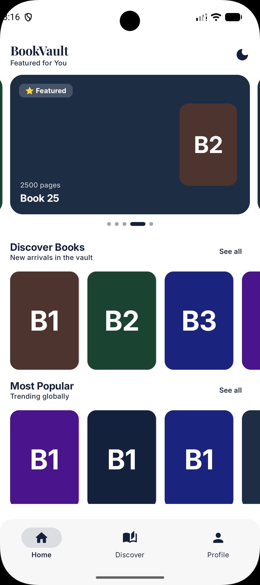
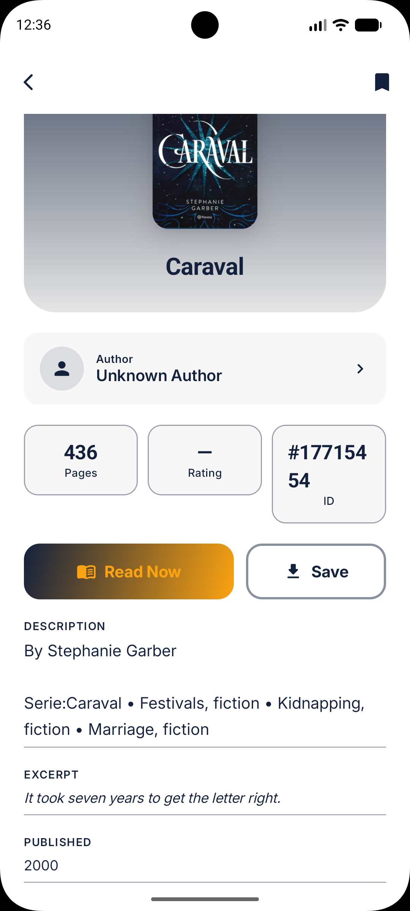
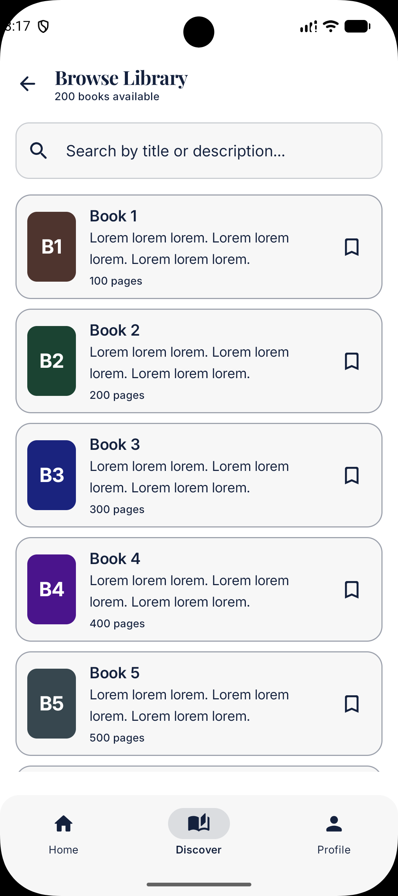
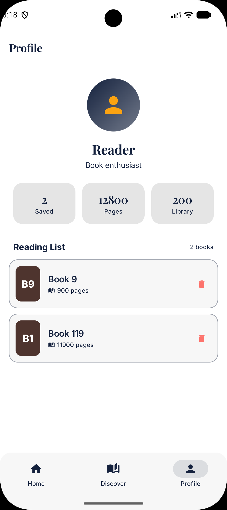
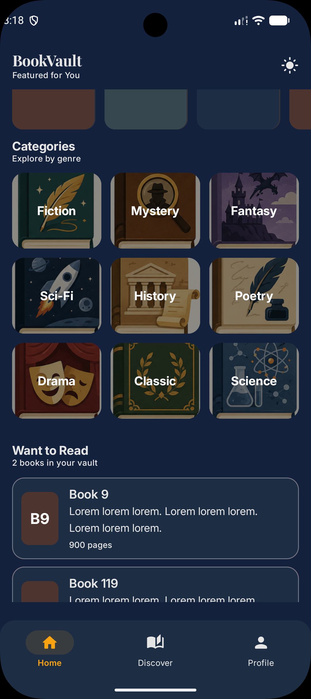
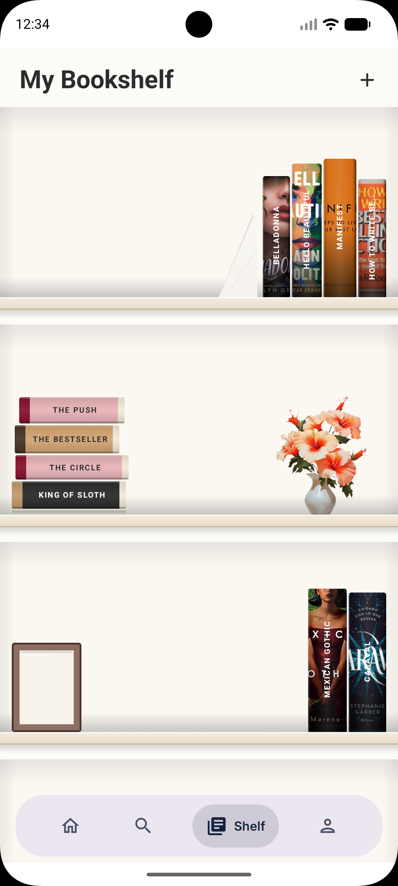

# BookVault

A modern Android reading-list manager built with Jetpack Compose and clean MVVM architecture. Connects to a live book catalogue API, stores your personal picks locally with Room, and works fully offline after the first fetch.

---

## Screenshots

<div align="center">

| Home | Book Detail | Browse |
|:----:|:-----------:|:------:|
|  |  |  |

| Profile | Dark Mode | Splash |
|:-------:|:---------:|:------:|
|  |  |  |

</div>

---

## Overview

BookVault lets you discover books from a public REST API, browse and search the full catalogue, and maintain a personal reading list stored locally. The UI is built entirely in Jetpack Compose with Material3, following a clean Use-Case-driven MVVM pattern and Koin for dependency injection.

---

## Features

**Home**
- Horizontal discover and popular rows pulled from the live API
- Personal reading list with swipe-left-to-remove gesture
- Bottom sheet entry point: browse the API catalogue or add a book manually
- Dark and light mode toggle

**Browse**
- Full-text search across title and description
- Animated search clear button and empty state handling
- Bookmark toggle to save books directly to your reading list

**Book Detail**
- Generated gradient cover art derived from the book title
- Page count, publish date, description, and excerpt sections
- Save to reading list and delete actions

**Profile**
- Reading stats: books saved, total pages, full library size
- Complete reading list with individual remove actions

**Add Book**
- Manual entry form: title, description, page count, excerpt

**Offline Support**
- All API responses are cached in Room; the reading list is always available without a network connection

---

## Architecture

```
BookVault/
├── data/
│   ├── local/          # Room database, DAOs, entities, mappers
│   ├── remote/         # Ktor client, BookApiService, DTOs
│   └── repository/     # BookRepositoryImpl, SavedBookRepositoryImpl
├── di/                 # Koin modules (App, Database, Network)
├── domain/
│   ├── model/          # Book, SavedBook
│   ├── repository/     # Repository interfaces
│   └── usecase/        # GetBooks, SaveBook, DeleteSavedBook, IsBookSaved, etc.
└── presentation/
    ├── components/     # BookCoverPlaceholder
    ├── navigation/     # NavGraph, Screen
    ├── screens/        # Home, Browse, Detail, Profile, AddBook, Splash
    ├── ui/theme/       # Color, Type, Theme
    ├── viewmodel/      # BookViewModel, BookUiState
    └── MainShell.kt    # Root scaffold with bottom navigation bar
```

**Data flow:** `Compose UI → ViewModel (StateFlow) → Use Cases → Repository → Room / Ktor`

---

## Tech Stack

| Layer | Library |
|---|---|
| UI | Jetpack Compose 1.7, Material3 |
| Navigation | Navigation-Compose |
| State | AndroidX ViewModel + StateFlow |
| Dependency Injection | Koin 3.x |
| Networking | Ktor (Android engine) + Kotlinx Serialization |
| Local Database | Room 2 |
| Language | Kotlin |
| Min SDK | 26 (Android 8.0) |
| Compile SDK | 35 |

---

## API

Uses the free [FakeRestAPI](https://fakerestapi.azurewebsites.net/) for book data.

| Method | Endpoint | Purpose |
|--------|----------|---------|
| GET | `/api/v1/Books` | Fetch full catalogue |
| GET | `/api/v1/Books/{id}` | Fetch single book |
| POST | `/api/v1/Books` | Add a book |
| DELETE | `/api/v1/Books/{id}` | Delete a book |

---

## Database Schema

Room database version 2, migrated from version 1 via `MIGRATION_1_2`.

```sql
CREATE TABLE books (
    id          INTEGER NOT NULL PRIMARY KEY,
    title       TEXT    NOT NULL,
    description TEXT    NOT NULL,
    pageCount   INTEGER NOT NULL,
    excerpt     TEXT    NOT NULL,
    publishDate TEXT    NOT NULL
);

CREATE TABLE saved_books (
    id          INTEGER NOT NULL PRIMARY KEY,
    title       TEXT    NOT NULL,
    description TEXT    NOT NULL,
    pageCount   INTEGER NOT NULL,
    excerpt     TEXT    NOT NULL,
    publishDate TEXT    NOT NULL,
    savedAt     INTEGER NOT NULL
);
```

---

## Getting Started

**Prerequisites**
- Android Studio Hedgehog or newer
- JDK 17+
- Emulator or physical device running API 26+

**Run**

```bash
git clone https://github.com/aviavinas01/BookVault.git
cd BookVault
./gradlew assembleDebug
adb install app/build/outputs/apk/debug/app-debug.apk
```

---

## Roadmap

- Replace placeholder author data with a real author API
- Implement in-app reader (ePub / PDF)
- Add filtering and sorting to the Browse screen
- Reading progress tracking per book
- Push notification reading reminders
- R8 release build optimisation

---

## License

MIT License. Copyright (c) 2026 BookVault.

Permission is hereby granted, free of charge, to any person obtaining a copy of this software and associated documentation files (the "Software"), to deal in the Software without restriction, including without limitation the rights to use, copy, modify, merge, publish, distribute, sublicense, and/or sell copies of the Software, and to permit persons to whom the Software is furnished to do so, subject to the following conditions: The above copyright notice and this permission notice shall be included in all copies or substantial portions of the Software.